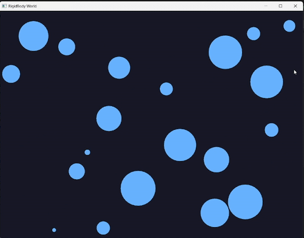
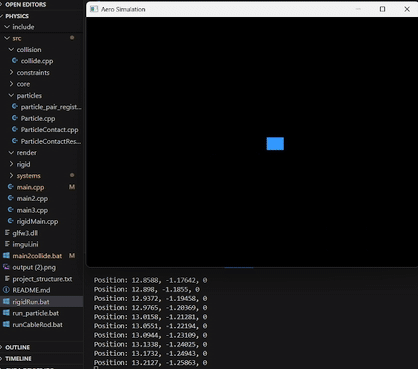
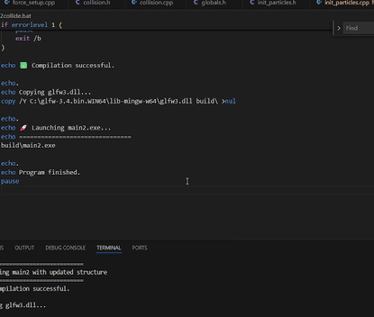
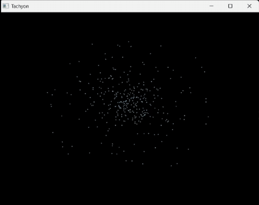

# Tachyon Physics Simulation

A lightweight C++ physics engine built from scratch, based on concepts from Ian Millington’s *Game Physics Engine Development*.  
This project demonstrates early-stage physics simulations including rigid body dynamics, collision resolution, and particle systems.

  

---

##  Features

- Rigid body dynamics (initial flying box)
- Particle collisions (broad phase + narrow phase)
- Spring-damped particle systems
- Gravity, damping, pairwise collision resolution
- GLFW and OpenGL visualization
- ImGui GUI integration (WIP)

---

##  How to Run

1. Make sure you have the dependencies installed (below).
2. Use the batch files:
   - `main2collide.bat` → Runs the collision particle visualizer
   - `run_particle.bat` → Runs the spring, constraint, and force demonstrations
   - and a couple others..
3. Batch files automatically compile and launch the simulations.

---

##  Dependencies

- **g++** compiler (MinGW-w64 recommended)
- **GLFW 3.4** (precompiled binaries)
- **OpenGL** (system provided)
- **ImGui** (included in `/external/imgui`)
- **Windows OS** (batch file setup)

---

#  Simulations

## 🛩️ Flying Dutchman — Rigid Body Flying Box

An early rigid-body simulation where a single box "flies" using simple force and torque modeling.  
Inspired by Ian Millington’s flight simulator example.

  

---

## 💥 Particle Collision — First Collision Implementation

An enlarged particle system used to demonstrate broad-phase and narrow-phase collision detection and response.

  

---

## 🌌 Particle Springs and Forces — Gravity + Constraints

Demonstrates a network of particles interacting through:
- Gravity
- Spring forces
- Damping
- Collision detection
- Pairwise interactions

  

---
